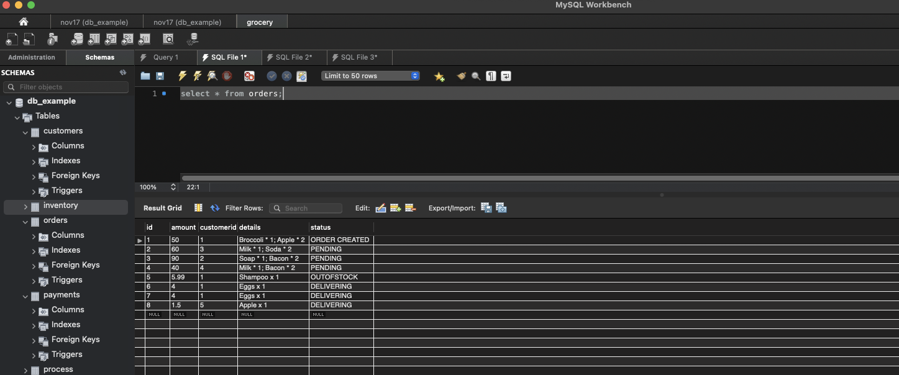
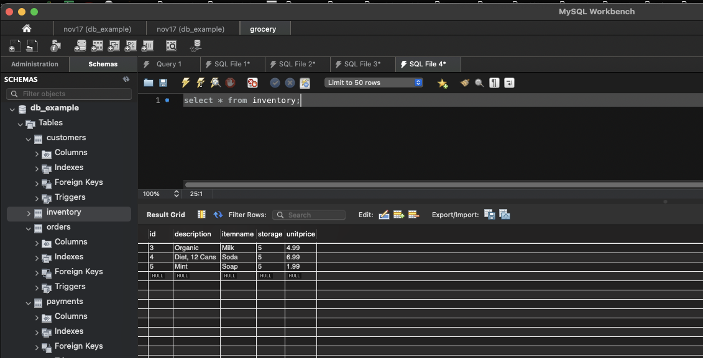
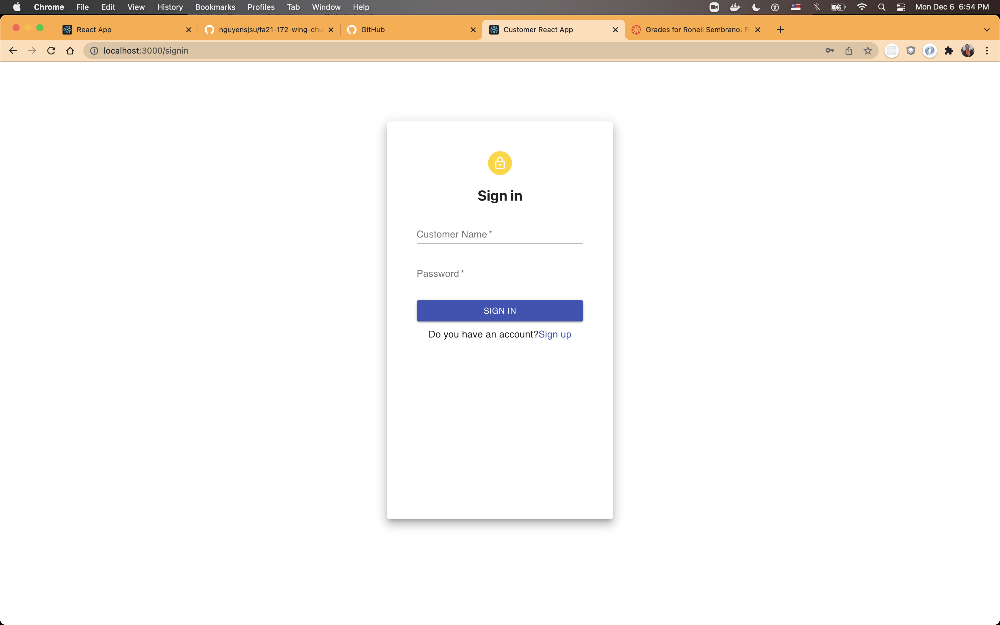
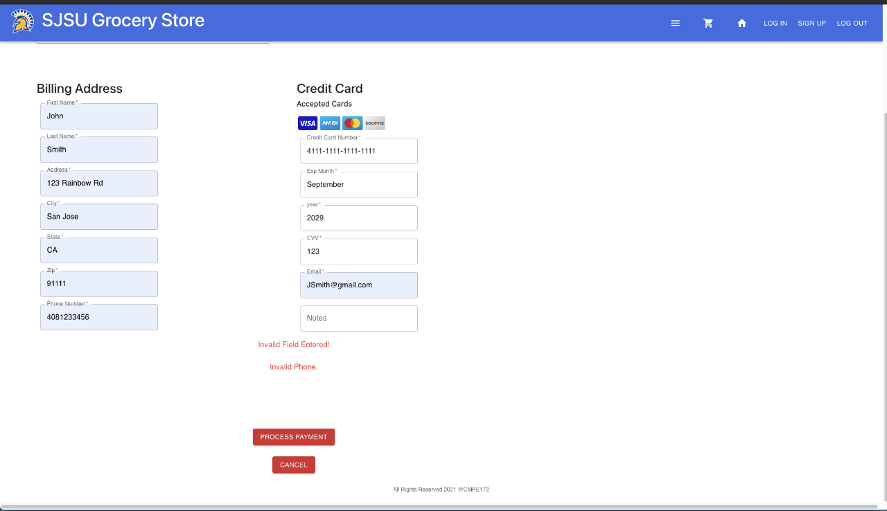

# Grocery Store Online Application

Java 11, Spring Boot 2.4, Docker v20, dependencies up to date.

### __Table of Contents__
- [Grocery Store Online Application](#grocery-store-online-application)
    - [__Table of Contents__](#table-of-contents)
    - [__Project Description__](#project-description)
    - [__Spring Boot__](#spring-boot)
    - [__Database Schema__](#database-schema)
    - [__Deployment On GKE__](#deployment-on-gke)
    - [__User Interface__](#user-interface)
    - [__Contributer__](#contributer)
   
### __Project Description__
This project is a practise about intergrating most of the skills I have learned in the course: CMPE172 Enterprise Software, SJSU. This application contains most comon features in online shopping such as: user registeration, order generalization, payment processing, office-front-end(customer & inventory management),etc. 

Features in this application are splited as micro-services and be deployed on GKE(Google Cloud Engine). Micro-services such as:

- Grocery Store front-end (Task 1~3) provides user interface for: 
  - customer login/sign in 
  - select items and put them into cart
  - create orders base on item in cart
  - payment process
- Back Office Portal (Task 4) provides user interface for:
  - employee login
  - view / update customer information (name/password)
  - view / update order inforamtion (items/order status)
  - view / update inventory
- Back-end services to cooperate with fron-ends
- Database to store data across the appliation.

### __Spring Boot__ 
All the back-end services are build by Spring Boot. It makes the application to be stand-alone, and be ready for produciton-grade Spring based Apllication on the go. After build and test in Spring Boot, the applicaiton is moved to containerized docker repository for the deployment phase.

### __Database Schema__
The application has four schemas which are:
  - customer: stores name, password, contact information.
  - inventory: current inventory of each item for the store.
  - order: orders created by each cutomer. Each order contains customer id, items, amount, status.
  - payment: stores the status of each payment, including reference number, order id, etc.
  
  

  

### __Deployment On GKE__
The application is deployed on GKE
- Database is using Google Cloud SQL service
- Deployment Sequence
   
- Deploy on GKE
  

### __User Interface__
- customer login/signup
  
  
  
- shooping cart
  

- payment page
  
### __Contributer__
Xuefeng (snow) Xu